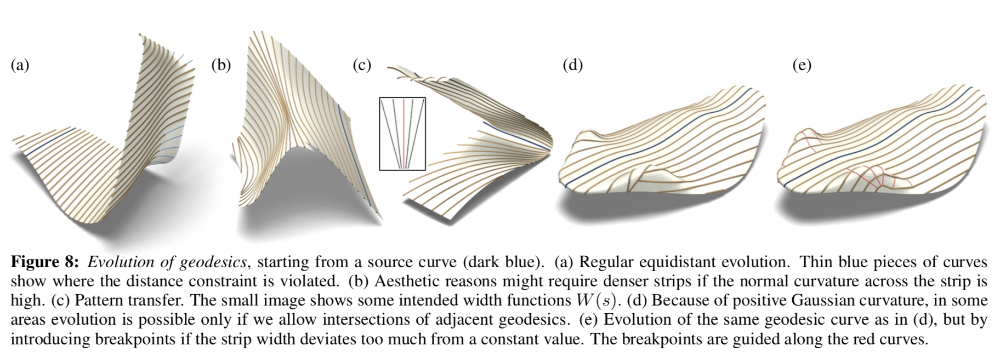
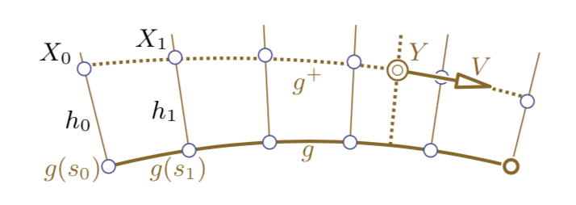
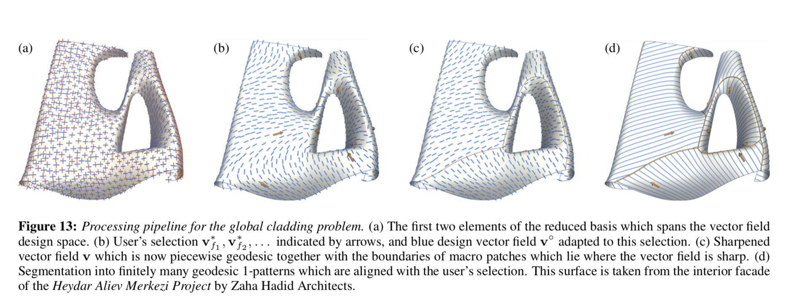

# To-Do List

- [ ] Decide about images
  - [ ] Parallel Transport...etc...
- [ ] Finish reading references
- [ ] Summarize all keypoints
- [ ] Implement Parallel Transport
- [ ] Talk to Gerard about
  - [ ] Autoría de los capítulos
  - [ ] Studio 2 Paper
  - [ ] ??
  - [ ] Template design
  - [ ] Math notation standarization
  - [ ] Level of detail in algorithms
  - [ ] Geodesic generation
  - [ ] Construction
- [ ] **GEODESIC GENERATION**
  - [ ] Geodesic = Shortest Path?
  - [ ] Best option would be starting with point and vector.
  - [ ] Shortest path could be easily implemented
  - [ ] Shortest path + T.N.B frame is +50% of the algorithm.
  - [ ] Could yield nice results for a ***phisical model***

# List of images to create

## Parallel transport

- [ ] Parallel transport procedure
- [ ] the parallel transport method applied to a surface 

## Evolution method

- [ ] Evolution method explanation 
- [ ] Evolution method -> distance from geodesics 
- [ ] Distance between Geodesics 
- [ ] Optimization 

## Geodesic vector fields

- [ ] Geodesic vector field user-guided generation 
- [ ] Geodesic vector field sharpening 

# List of graphs to create

- [ ] Cost/Quality comparison chart
- [ ] ...