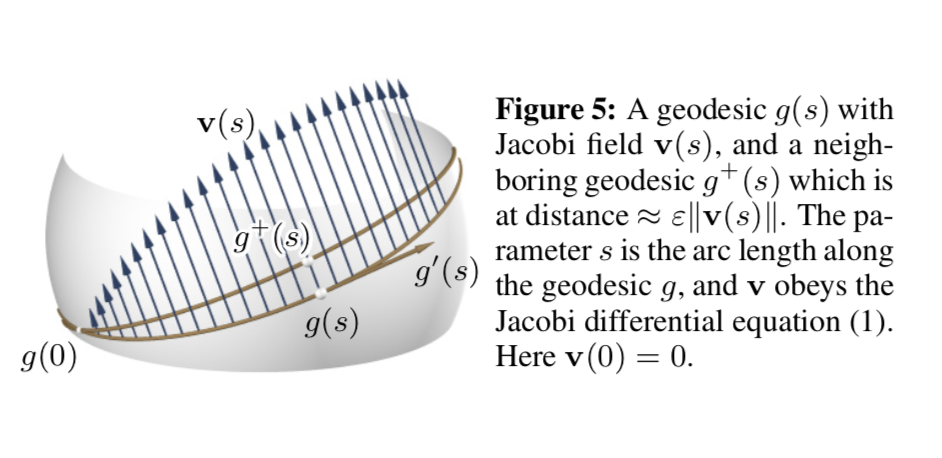
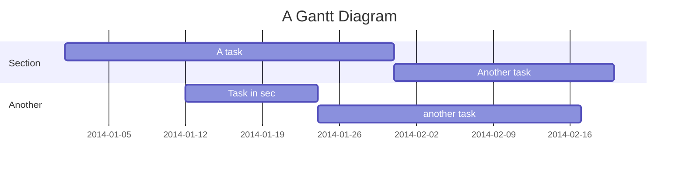
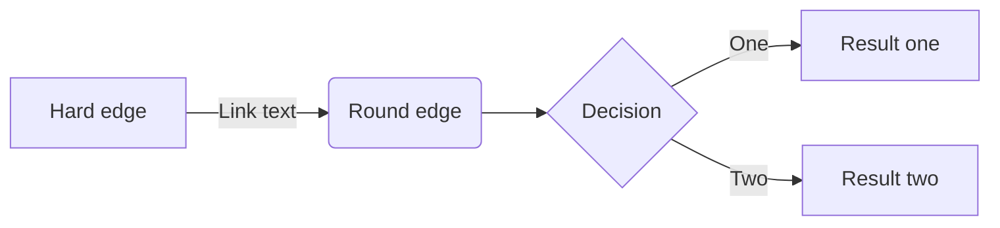

[^email]: ***E-mail:*** alan@rynne.es
[^affil]: ***Affiliation***: Universitat Politècnica de Barcelona - Escola de Architectura Superior del Vallès (UPC-ETSAV)

[//]: # (This may be the most platform independent comment)

# Introduction

## Basic terminology 

Geodesic curve $\rightarrow g$
: A geodesic curve $g$ is a locally shortest path on a surface $S$.  

Jacobi field $\rightarrow\mathbf{v}(s)$
:  Paste definition here

## Geodesic patterns

What are geodesic patterns?

* Patterns made of panels (wood or metal).
* Bent by their weak axis.
* Mounted on a free-form surface.
* Rectangular or cuasi-rectangular when layed flat.
* Water-tight.
* Overall shape is achieved by pure bending. See [@Fig:previousWork]

{#fig:previousWork}

## Properties to aim for in panels

### Geodesic property

> * Long Thin panels that bend about their weak axis
> * Zero geodesic curvature
> * Represent the shortest path between two points on a surface  

### Constant width property [^3]

[^3]: This is just some random footnote in the paper.

> * Panels whose original, unfolded shape is a rectangle.
> * The only way this can happen is if the entire surface is developable.
> * For all other surfaces:
>   * Assuming no gaps between panels
>   * Panels will not be exactly rectangular when unfolded
>   * ***Requirement:*** Geodesic curves that guide the panels must have approximately constant distance from thier neighbourhood curves.

### Developable (or 'pure-bending') property

> * Bending panels on surfaces changes the distances in points only by a small amount so,
> * A certain amount of twiting is also present in thi`
> s aplications.\
> ***Some methods in this chapter  do not take into account this property.***

## Problem Statement

### Problem 1

Look for a system of geodesic curves that covers a freeform surface in a way that:

1. They have approximate constant distance with it's neighbours.
2. This curves will serve as guiding curves for the panels.
3. The panels are to cover the surface with ***no overlap*** and ***only small gaps***

### Problem 2

Look for a system of geodesic curves in a freeform surface which:

1. Serve as the boundaries of wooden panels.
2. The panel's deveopment is ***nearly straight***.
3. Those panels cover the surface with ***no gaps***

# Algorithmic ways of generating geodesics

## Start point + Directon problem

## Start point + End point problem

# Design strategies for geodesic systems

## Design by parallel transport

This method, described in [@Pottmann2010-ku], allows for the generation of a system of geodesic curves where either the maximum distance or the minimum distance between adjacent points ocurrs at a prescribed location.

> In differential geometry, the concept of *parallel transport* (see [@fig:partrans]) of a vector ***V*** along a curve ***S*** contained in a surface means moving that vector along ***S*** such that:
>
> 1. It remains tangent to the surface
> 2. It changes as little as possible in direction
> 3. It is a known fact that the length of the vector remains unchanged

{#fig:partrans}

> ***MISSING PARALLEL TRANSPORT PROCEDURE***

Following this procedure, *extremal distances between adjacent geodesics occur near the chosen curve.*

## Design by evolution & segmentation

Two main concepts are covered in this section, both proposed by [@Pottmann2010-ku]: the first, what is called the *evolution method*, and a second method based on *piecewise-geodesic* vector fields.

### The *evolution method*

As depicted in: Starting from a source geodesic somewhere in the surface:

* Evolve a pattern of geodesics iteratively computing 'next' geodesics.

* 'Next' geodesics must fullfil the condition of being at approximately constant distance from its predecesor.

* If the deviation from its predecesor is too great, breakpoints are introduced and continued as a *'piecewise geodesic'.*

* 'Next geodesics' are computed using Jacobi Fields

### Distances between geodesics

1. No straight forward solution.
    1. Only for rotational surfaces (surfaces with evenly distriuted meridian curves).
2. **But** a first-order aproximation of this distance can be approximated:

> Starting at time $t=0$ with a geodesic curve $g(s)$, parametrized by arc-length $s$, and let it move within the surface.  
> A snapshot at time $t=\varepsilon$ yields a geodesic $g^+$ near $g$.

$$g^+(s)=g(s)+\varepsilon\mathbf{v}(s) + \varepsilon^2(\ldots)$${#eq:nextGeodesic}

The derivative vector field $\mathbf v$ is called a *Jacobi field*. We may asume it is orthogonal to $g(s)$ and it is expressed in terms of the geodesic tangent vector $g'$ as:

$$\mathbf v(s) = w(s)\cdot R_{\pi/2}(g'(s)),\quad\text{where}\; w'' + Kw = 0$${#eq:jacobiField}

Since the distance between infinitesimally close geodesics are governed by [@Eq:jacobiField], that equation also goberns the width of a strip bounded by two geodesics at a small finite distance.

Using this principle, you can develop strips whose width $w(s)$ fulfills the Jacobi equation $w(s)=\alpha \cosh(s \sqrt{|K|})$[^question] for some value $K<0$.  
Gluing them together will result in a surface of approximate Gaussian curvature.

[^question]: **Question:** What is $\alpha$ in this formula? Missing image

{#fig:distanceGeo width=50%}
{#fig:sphereGeoDist width=50%}

Geodesic distances on sphere

#### Algorithm pseudocode:

$$PENDING$$

### Piecewise-geodesic vectorfields

{#fig:vectorFieldAlgo}

{#fig:vectorFieldSharp}

# Panels from curve patterns

In this section, we will discuss several ways to generate panels from a system of 1-geodesic curves.

## Tangent-developable method

The notion of ***Conjugate tangents*** on smooth surfaces must be defined:

> * Strictly related to the ***Dupin Indicatrix***
> * In negatively curved areas, the Dupin Indicatrix is an hyperbola whose asymptotic directions (A1, A2)
> * Any parallelogram tangentialy circumscribed to the indicatrix defines two conjugate tangents **T** and **U**.
> * The asymptotic directions of the dupin indicatrix are the diagonals of any such parallelogram.

Initial algorithm is as follows:

>For all geodesics $s_i$ in a given pattern:
>
>  1. Compute the *tangent developable surfaces* $\rightarrow\Psi_i$
>  2. Trim $\Psi_i$ along the intersection curves with their respective neighbours.
>  3. Unfold the trimed $\Psi_i$, obtaining the panels in flat state.

***Unfortunately***, this method needs to be refined in order to work in practice because:

> 1. The rulings of tangent developables may behave in weird ways
> 2. The intersection of the neighbouring $\Psi_i$'s is often *ill-defined*.

Therefore, the procedure was modified in the following way:

> 1. Compute the *tangent developable surfaces* $\Psi_i$ for all surfaces $s_i \rightarrow i=\text{even numbers}$
> 2. Delete all rulings where the angle enclose with the tangent $\alpha$ is smaller than a certain threshold (i.e. 20º).
> 3. Fill the holes in the rulings by interpolation (???)
> 4. On each ruling:
>    1. Determine points $A_i(x)$ and $B_i(x)$ which are the closest to geodesics $s_{i-1}$ and $s_{i+1}$. This serves for trimming the surface $\Psi_i$.
> 5. Optimize globaly the positions of points $A_i(x)$ and $B_i(x)$ such that
>     1. Trim curves are *smooth*
>     2. $A_i(x)$ and $B_i(x)$ are close to geodesics $s_{i-1}$ and $s_{i+1}$
>     3. The ruling segments $A_i(x)B_i(x)$ lies close to the *original surface* $\Phi$

{#fig:tangentDevMethod}

## The Bi-Normal Method

The second method for defining panels, once an appropriate system of geodesics has been found on $\Phi$, works directly with the geodesic curves.

> Assume that a point $P(t)$ traverses a geodesic $s$ with unit speed, where $t$ is the time parameter.
> For each time $t$ there is:
>
> * a velocity vector $T(t)$
> * the normal vector $N(t)$
> * a third vector $B(t)$, *the binormal vector*
>
> This makes $T.N.B$ a ***moving orthogonal right-handed frame***

The surface $\Phi$ is represented as a triangle mesh and $s$ is given as a polyline.
For each geodesic, the associated surface is constructed according to [@Fig:binormalMethod]. Points $L(t)$ and $R(t)$ represent the border of the panel, whose distance from $P(t)$ is half the panel width.

{#fig:binormalMethod}

## Method Comparison

See [@tbl:stressComparisson] for more info...

# Stress and strain in panels

The following section investigates the behaviour of a rectangular strip of elastic material when it is bent to the shape of a ruled surface $\Psi$ un such way that:

> The central line $m$ of the strip follows the *'middle geodesic'* $s$ in $\Psi$

This applies to both methods defining panels.[@fig:panelStress]

{#fig:panelStress}

## Stress formulas

> $$ \rho=1/{\sqrt K}, $$  {#eq:eqLabel}

> $$ d/2\rho\leq C,\quad with\quad C=\sqrt{\sigma _{max}/E}, $$ {#eq:eqLabel2}

> $$\varepsilon=\frac{1}{2}(d/2\rho)^2 + \cdots.$$ {#eq:eqLabel3}  

**MISSING MORE INFO ON STRESS ANALYISIS**

# Final analysis cost, quality

All strategies must be compared against cost & quality of the different solutions.

{#fig:costQuality}

## Frequent measures used in the topic

* Bounding-box diagonal of the panels

## Cost variables

Cost should be defined as:

 1. ???
 2. ???
 3. ???

## Quality variables

Quality should be defined as:

 1. ???
 2. ???
 3. ???

## Variable weighting method

Explanation of the weighting of variables?

# Math Section

 Some nomenclature and formula clarification for the non-mathematicians!?

## Nomenclature guide

1. $\rho$
2. $\tau$
3. $\Phi$
4. $\Psi$
5. $s$
6. $V,T,N,B$
7. $\theta$
8. $\sigma$
9. $\text{Add more...}$

## Formulas & referencing guide

LaTeX formulas and reference them (like [@Eq:eqLabel] or multiple at once like [@Eq:eqLabel2;@eq:eqLabel3]) can be inserted using `$$` and formated using Symbols.PDF found in the 'resources' folder.

References are placed using the format `[@type:label]`, being `label` the unique name of the desired reference on the format, and `type` the type of reference, in the following format:

* Images: `{#fig:LABEL}`
* Tables: `{#tbl:LABEL}`v
* Equations: `{#eq:LABEL}`
* Sections: `{#sec:LABEL}`
  * If sections are added, they will change all the reference names to include their corresponding sectionsd
* Code blocks: `{#lst:LABEL}`

### Distances between geodesics ([@Eq:geodesicD;@eq:geodesicD2])

> $$g^+(s) = g(s) + \varepsilon\mathbf{v}(s) + \varepsilon^2(\ldots)$${#eq:geodesicD}

> $$\mathbf{v}(s)=\omega(s) \cdot R_{\pi/2}(g'(s)),\quad where\quad \omega'' + K\omega = 0.$${#eq:geodesicD2}

Tables are also an option:

| **Tangent-Developable Method**                        | **Bi-Normal Method**                                             |
| ----------------------------------------------------- | ---------------------------------------------------------------- |
| Tries tor reproduce panels achievable by pure bending | Simple, obvious way of mathematically defining panels            |
| Panels produced remain tangent to the surface         | **Unclear** if the panels should follow this shape.              |
| Follows a manufacturing goal                          | Panel surfaces are mathematically exact                          |
|                                                       | Panels are admissible  from the viewpoint of stresses and strain |
: Comparisson between panel generation methods {#tbl:stressComparisson}

HTML figure disposition is also available, with customization options like width, per image captions, etc...

{#fig:cfa width=30%}
{#fig:cfb width=60%}
{#fig:cfc width=10%}

Difference between width-settings, nocaption option, etc... [@Fig:coolFig] is a full figure reference, but you can also reference just one of the images, like [@Fig:cfa;[@Fig:cfb;[@Fig:cfc].

And some very nice diagrams too, using the Mermaid library

[comment]: # (To render mermaid in PDF's as vector images replace 'mermaid' for '{.mermaid format=pdf}')

[comment2]: # (This is another comment)

# References that must be used

* [@eigensatz2010paneling]
* [@Chen1996-ii]
* [@Kahlert2010-wd]
* [@Surazhsky2005-al]
* [@Arsan2015-jc]
* [@Pottmann2010-ku]
* [@Polthier1998-dn]
* [@Do_Carmo2016-kx]
* [@Kimmel1998-ut]
* [@Rose2007developable]
* [@Weinand2006TimberRib]
* [@Wallner2010tiling]
* [@jia2017curves]
* [@pottmann2015architectural]
* [@pottmann2010architectural]
* [@pottmann2008geometry]
* [Geodesic Lines Grasshopper implementation](https://www.grasshopper3d.com/forum/topics/geodesic-distance-from-points-on-mesh)

# References
